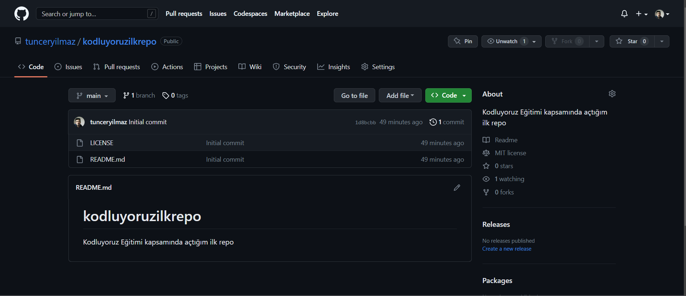

# **Kodluyoruz İlk Repo**

Bu repo [Kodluyoruz](https://kodluyoruz.org/) Front-End eğitiminde oluşturduğumuz ilk repo içerisinde bir adet README dosyası, bir adet de index.html barındırıyor.


# **Installation**

Öncelikle projeyi clonelayın.

```

git clone https://github.com/tunceryilmaz/kodluyoruzilkrepo

```

# **Usage**

Projeyi cloneladıktan sonra Visual Studio Code programında açınız.

Linux için:

```

cd kodluyoruzilkrepo
code .

```

# **Contributing**

Pull requestler kabul edilir.Büyük değişiklikler için, lütfen önce neyi değiştirmek istediğinizi tartışmak için bir konu açınız.

# **License**

[MIT](https://github.com/tunceryilmaz/kodluyoruzilkrepo/blob/main/LICENSE)
